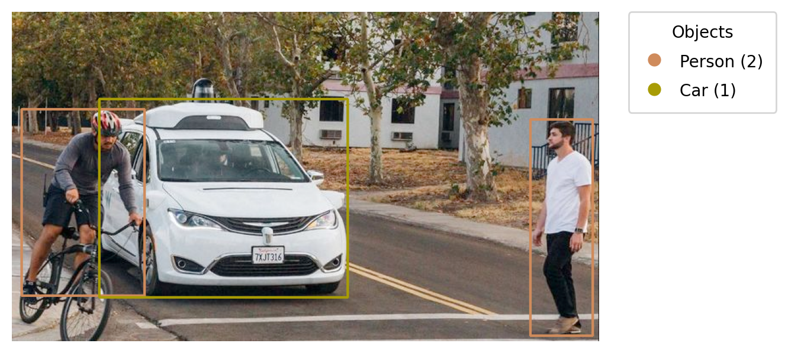

# Object Detector

Object Detector is a Python-based application that detects objects in an image using YOLO model. It highlights detected objects above a certain confidence threshold and generates an output image with a legend. The legend includes the color assigned to each object class and the total count of each detected object (e.g., people, cars, etc.).

## Example Output


## Features

- Detects multiple objects in an image using YOLO model
- Filters results based on a confidence threshold
- Draws bounding boxes and class labels
- Generates a color-coded legend showing:
  - Each object class
  - Assigned color
  - Count of each object type
- Saves the output as an image

## Tech Stack

- Python
- OpenCV
- NumPy
- YOLO
- Matplotlib

## Installation

1. Clone the repository:
```bash
git clone https://github.com/DevAmirSaman/object-detector.git
cd object-detector
```
2. Install dependencies:

```bash
pip install -r requirements.txt
```
