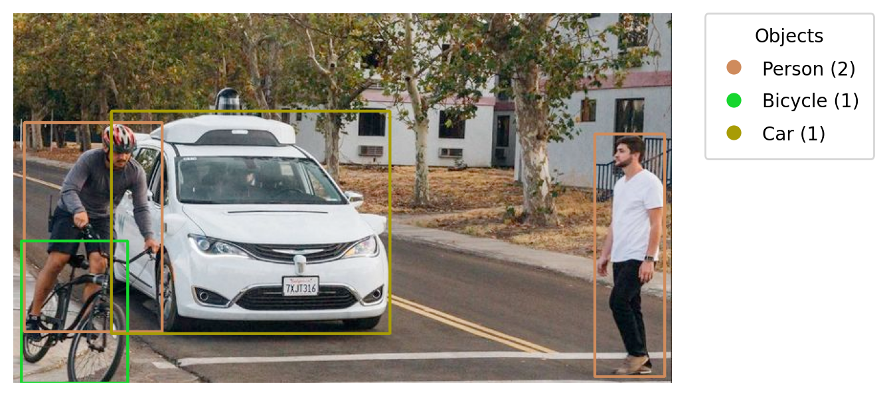
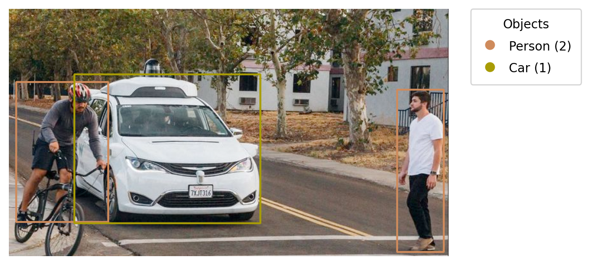

# Object Detector

**Object Detector** is a Python-based application that uses the **YOLO** model to detect objects in images.
It highlights detected objects above a specified confidence threshold and saves an output image with a color-coded legend showing the detected classes and their counts.

## Example Output
<p>Without class filtering</p>

<p>With class filtering</p>


## Features

- Detects multiple objects in one or more images using the YOLO model
- Batch image processing for faster inference on multiple files
- Filters detections based on a configurable confidence threshold
- Optional class filtering → detect only specific objects (e.g., people, trees, cars)
- Draws bounding boxes for each detected object
- Generates a color-coded legend showing:
  - Each object class
  - Assigned color
  - Count of each object type
- Saves the output as an image

## Tech Stack

- Python
- OpenCV
- NumPy
- YOLO
- Matplotlib

## Installation

1. Clone the repository:
```bash
git clone https://github.com/DevAmirSaman/object-detector.git
cd object-detector
```
2. Install dependencies:

```bash
pip install -r requirements.txt
```

## Usage
**Detect objects in one or more images**
```bash
python main.py
```
Inside `main.py`, you can configure:
- `image_paths` → List of one or more image file paths
- `conf_threshold` → Confidence threshold (default: 0.4)
- `objects` → Optional set of class names to filter (e.g., {'person', 'car'})

### Filtering specific objects

The `filtered_objects` variable lets you limit detection to specific object classes.
Example:
```python
filtered_objects = {'person', 'tree', 'car'}
```
In this example, YOLO will run detection normally, but only **people**, **trees**, and cars will be drawn and counted in the output.
If you set it to `None`, **all detected classes** will be included.

### Example configuration:
```python
filtered_objects = {'person', 'tree', 'car'}
batch = [
    'img.png',
    'img_1.png'
]
main(image_paths=batch, conf_threshold=0.4, objects=filtered_objects)
```
### Output
- Processed images are saved in the same directory, prefixed with `detected_`
- Each image contains:
  - Bounding boxes around detected objects
  - A legend with color coding and counts
